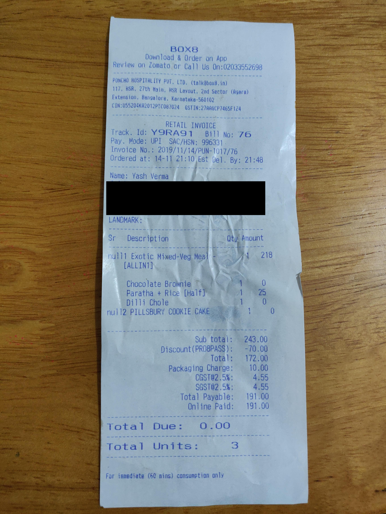
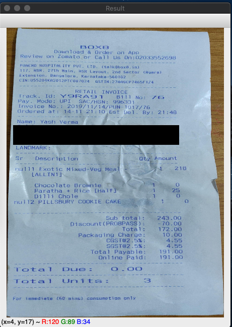

# PyCamScanner

PyCamScanner is a tool that allows users to isolate a document from a supplied image.

### Prerequistes

Before you begin, ensure that you have met the following requirements:

- You have installed Python3 and the following packages:
  - OpenCV-Python (4.1.1)

### Using PyCamScanner

To use PyCamScanner, follow these steps:

- Run code.py and pass the image with the document as follows:

  `python3 code.py test.jpg`

When you run the command above, you should receive the following output for the following input image

#### Input Image (test.jpg)

#### Output image

### Future updates

- Warping perspective and transforming perspective
- Extracting information from the supplied image
- Integration for a phone application

### Contact
If you got questions, you can reach me at yashv9119@gmail.com
